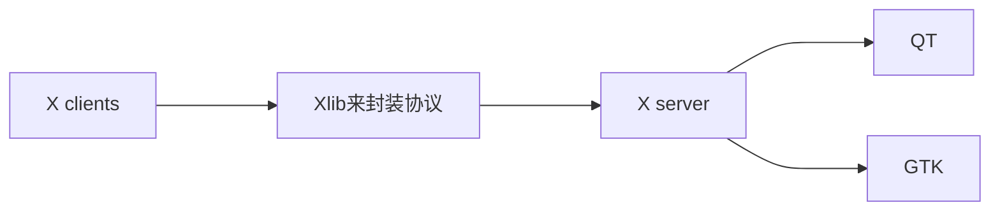
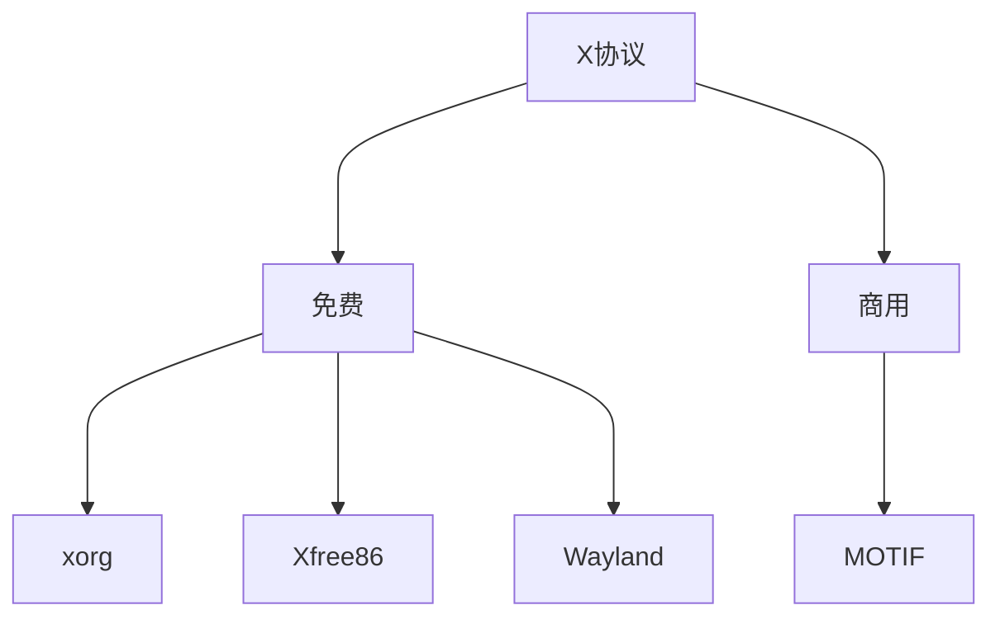

# 常用GUI库


### X协议

* X Window System(X11)，第11个版本。
* 下一代改进协议Wayland，Wayland不仅仅是要完全取代X11，取代目前Linux桌面上X Client/X Server的设计理念。

**注意事项：**
截至2020年大多数用于Linux的视频游戏和图形密集型应用程序仍为X11编写。但许多封闭源代码的图形驱动程序，例NVIDIA GPU的驱动程序都尚未完全提供对Wayland的支持。


##### X 协议由 X server 和 X client 组成：

* X server 管理主机上与显示相关的硬件设备，它负责屏幕画面的绘制与显示，以及将输入设备的动作告知 X client。

* X client 应用程序端则主要负责事件的处理（程序的逻辑）。

* Linux/Unix类操作系统上, ```$DISPLAY```设置图形显示出处.



X clients 了Xlib来封装协议；Xlib不够方便，于是就有了qt和gtk，提供了很多窗口控件（widgets）

#### X和XFree86

* XFree86基于X协议实现免费X服务器软件
* X Window System(X11)，第11个版本
* X11R6 实际上是 X Protocol version 11 Release 6(X协议第11版第六次发行)

X和XFree86：

XFree86只是实现X协议的一个免费X服务器软件.商业上常用MOTIF,现在还有XORG


